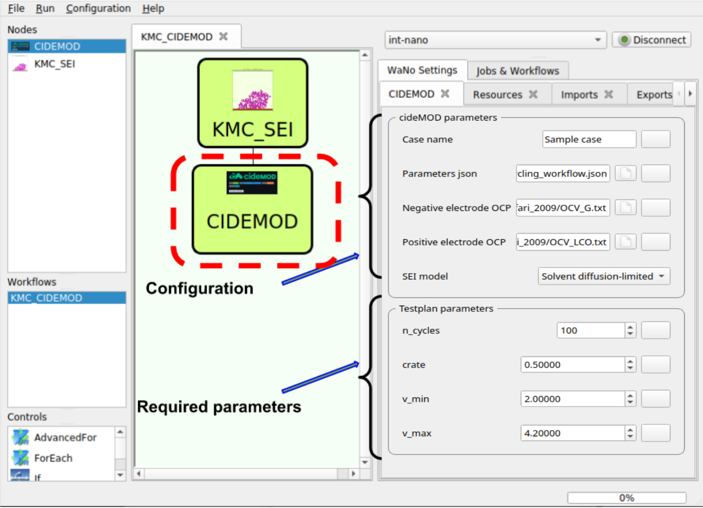

KMC_CIDEMOD
===========================================

<p align="center">

</p>

Overview
--------

The KMC to continuum workflow (KMC_CIDEMOD) is designed to establish a connection between Kinetic Monte Carlo (KMC) simulations and higher-level physics-based continuum models for batteries. This approach utilizes a bottom-up parameterization of pseudo-x-dimensional models (PxD) using information obtained from KMC trajectories. By bridging the gap between micro and macro scales, we can effectively describe the battery interface on the continuum scale.

Motivation
----------

Continuum models are powerful but often rely on assumptions about microscopic processes and require parameter fitting. These models are often formulated in 1D, leading to significant dimensionality reduction. However, the spatial degrees of freedom in PxD models do not directly correspond to physical variables in the complex microstructure of the battery. Our goal is to advance the field by computing some of these inputs from smaller scales, bridging KMC and continuum models.

Workflow Components
-------------------

The KMC_CIDEMOD workflow consists of two Workflow Active Nodes (WaNos) that collaborate to automate the integration between KMC simulations and PxD models as a higher-level continuum model.

1. KMC_SEI WaNo:
<p align="center">

</p>
   - Based on the 2D KMC protocol developed by [Prof. Wenzel’s group](https://doi.org/10.1002/aenm.202203966) 
, the KMC_SEI WaNo tracks the spatiotemporal evolution of organic and inorganic components of the SEI with nanometer resolution.
   - It identifies crucial reactions influencing SEI properties such as thickness and porosity.
   - User inputs like 2D lattice size, temperature, and activation energy barriers are taken to perform KMC simulations for the specified case.
   - A YAML file containing necessary parameters for the PxD model (SEI thickness and porosity) is generated as output.

3. CIDEMOD WaNo:
<p align="center">

</p>
   - Constructed based on [the cideMOD model](https://github.com/cidetec-energy-storage/cideMOD), an extension of the original P2D model, the CIDEMOD WaNo operates in X-dimensions.
   - It enables spatial resolution of charge and mass balance, reaction kinetics, energy balance, and thermal behavior in 2D and 3D cell geometries.
   - Parameters from the KMC_SEI WaNo are automatically received, and additional parameters based on specific case studies are set using configuration files (JSON, TXT).
   - The CIDEMOD WaNo provides information about cell performances, such as current, voltage, capacity, etc.

Workflow Description
---------------------

The simstack workflow used in this study starts with the KMC_SEI, where a KMC simulation for SEI formation is conducted to pass SEI thickness and porosity to the CIDEMOD WaNo. The second part of the workflow uses these KMC parameters along with additional user inputs to calculate current, capacity, and voltage profiles for different study cases. The output of the first WaNO (SEI properties) can vary based on the system's condition in the KMC_SEI WaNo (lattice size, temperature, and barriers). As a result, studying different cases in the second WaNo leads to different profiles of current, capacity, and voltages as cell performance.

Usage
-----

To use the KMC_CIDEMOD workflow, follow the instructions provided in the repository. Install the required dependencies and follow the defined steps to conduct KMC simulations and generate PxD models for your battery studies. The provided examples demonstrate the application of the workflow for different case studies.


## 1. Python Setup
To get this WaNo up and running on your available computational resources, make sure to have the below libraries installed on Python 3.7 or newer for the KMC_SEI WaNo:

```
itertools, os, random, sys, time, pickle, numpy, uniform, random, choice, sample, randrange,shuffle, math, yaml.
```
We recommend you to create a python (conda) `env` and install all mentioned python libraries. Then you can modify the `run.sh` file in KMC_SEO WaNo directory by sourcing the python environment that includes all required libraries:

in KMC_SEI/
```
# source the conda environment
source /path/to/etc/profile.d/conda.sh
conda activate python_env_kmc
```

For the CIDEMOD WaNo, follow python installayion instruction from `cideMOD` [documentation](https://cidemod.readthedocs.io/en/latest/). Then modify the run.sh in CIDEMOD WaNo direcory as:
```
# source the conda environment
source /path/to/etc/profile.d/conda.sh
conda activate python_env_cidemod
```
You can install all python packages in one environment.
## 2. KMC_SEI Inputs
- **Lattice size**: Identifying the 2D lattice size.
- **Temperature**: Specifying the teparature.
- **Save step**: Setting a KMC step at which the output will be updated.
- **Activation energy barriers**: Configuring the activation energy barriers of all involved reaction in KMC simulation (See table S1 [here](https://onlinelibrary.wiley.com/action/downloadSupplement?doi=10.1002%2Faenm.202203966&file=aenm202203966-sup-0001-SuppMat.pdf).
  Running this WaNo, a `rendered_wano.yml` file with all input parameters will be generated in the WaNo's directory.

## 3. CIDEMOD Inputs
- **KMC data**: The generated yaml file from the previous WaNo will be automaticly read in the second WaNo
- **JSON and TXT files**: Depending on the battery cell your are studying, you need to pass a set of files  as the case definition (more information on [cideMOD webpage](https://github.com/cidetec-energy-storage/cideMOD).
- **Number of cycles**: setting a values as the number of cycles as the first cideMOD parameter.
- **Crate**: setting a values as crate for the study case.
- **Minimum voltage**: setting a values as the minimum voltgae.
- **Maximum voltage**: setting a values as the maximum voltage.
Running this WaNo, a `rendered_wano.yml` file with all input parameters will be generated in the WaNo's directory.


## 4.KMC_CIDEMOD Output
Running the Workflow, it performs KMC simulation for the speficied configuration, and provide the SEI properties as `kmc_data.yml` for the the second WaNo. The cideMOD WaNo then uses the passed parameters and provide cell performence profiles as current, voltage, capacity etc.


## 5. Running this WaNo

- Step 1. Move the KMC_SEI and CIDEMOD folder to the WaNo directory. 
- Step 2. Open Simstack on your computer and connect to your remote resource.
- Step 3. Drag the WaNos from the top left menu to the SimStack canvas as shown in above figures.
- Step 4. A double click on the KMC_SEI WaNo will allow you to make the setups in the Input parameters.
- step 5. A double click on the CIDEMOD WaNo will allow you to make the setups in the Input parameters.
- Step 6. Name your WaNo with `Ctrl+S`, and running it with `Ctrl+R` command.

Sample
-----
The provided sample present the results for 'Safari_2019' data. Here a workflow as a KMC simulation for a parameters in `rendered_wano_kmc.yml` together with cideMOD parameters in `rendered_wano_kmc.yml` using data located `Safari_2019` resulted in data located in `results_Safari-2019_dl`.

Acknowledgments
---------------

This project has received funding from the European Union’s Horizon 2020 research and innovation programme under grant agreement No 957189. The project is part of BATTERY 2030+, the large-scale European research initiative for inventing the sustainable batteries of the future.


For more detailed instructions and examples, please refer to the documentation in the repository.
